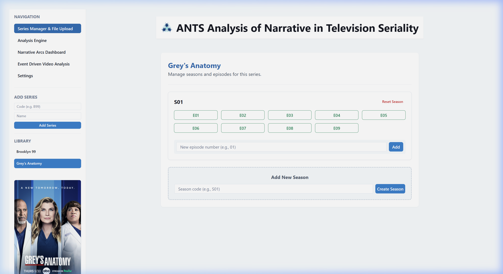
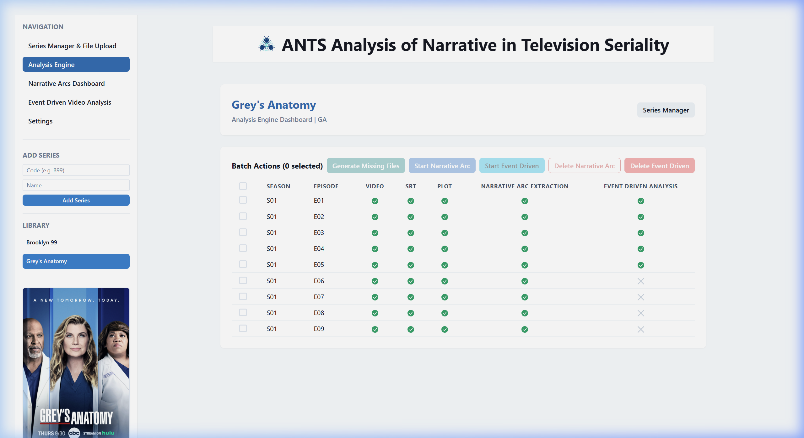
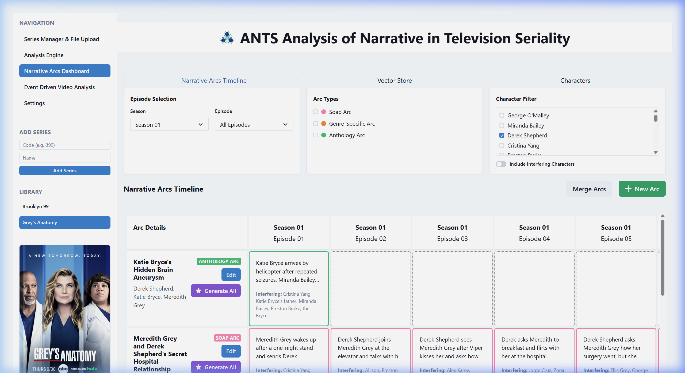
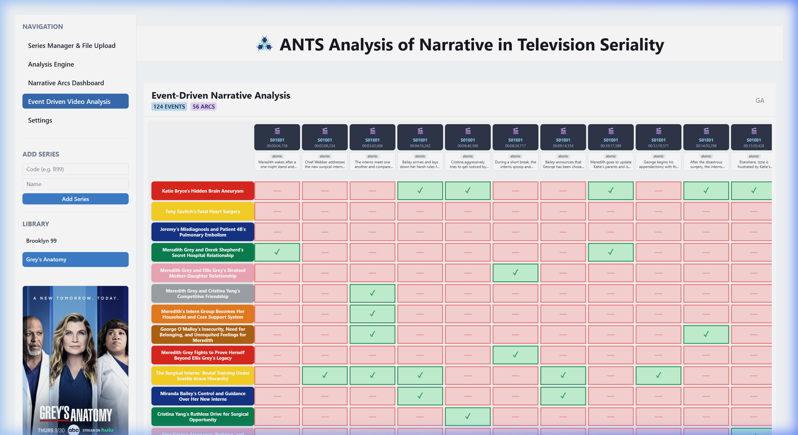
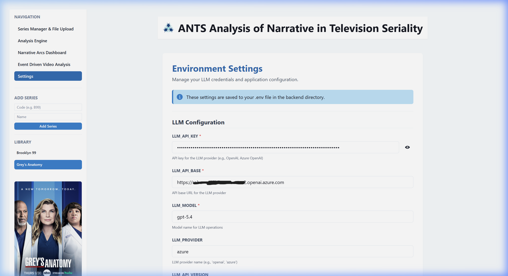

# ANTS: Visual and Functional Guide (Grey's Anatomy Edition)

Welcome to the user guide and documentation for **ANTS (Analysis of Narrative in Television Seriality)**. This document provides media scholars and television researchers with a comprehensive overview of the software's capabilities, utilizing **Grey's Anatomy** as the reference case study.

---

## 🖥️ 1. Series Manager & File Upload (Main Dashboard)

The **Series Manager** is the primary portal for managing your television research library. It acts as the central hub for ingestion and media organization.

### Key Features:
- **Series Ingestion:** Add television series to the catalog by assigning a unique Series Code (e.g., `GA` for *Grey's Anatomy*) and the official series title.
- **Library Selection:** Easily toggle between ingested series. Selecting *Grey's Anatomy* reveals its seasonal structure and episode lists.
- **Season & Episode Management:** Define season blocks and manage episode lists (e.g., *Grey's Anatomy* Season 1, Episodes E01 through E09).
- **Resource Uploads:** For any selected episode (such as S01E01 - "A Hard Day's Night"), scholars can upload:
  - The video file (MP4/MKV)
  - Subtitle files in `.srt` format (essential for NLP processing and dialogue analysis)
  - Plot summaries and synopses (to enrich contextual narrative understanding)

---

## ⚙️ 2. Analysis Engine (Processing Console)

The **Analysis Engine** provides a comprehensive control panel to trigger and monitor your narrative analyses.

### Key Features:
- **Interactive Resource Grid:** Displays a grid representing the availability of video assets, subtitle tracks, and plot metadata for each episode. It tracks the progress of downstream narrative and event-driven analyses.
- **Massive Batch Operations:**
  - **Generate Missing:** Triggers automated preprocessing tasks (e.g., generation of dialogues and plot summaries).
  - **Clear/Run Analyses:** Triggers or resets the core analyses for selected episodes.
  - **Start Narative Arc Extraction:** Triggers the multi-agent narrative arc extraction process for selected episodes.
  - **Start Event Driven Video Analysis:** Triggers the event-driven video analysis process for selected episodes.

---

## 📊 3. Narrative Arcs Dashboard (Arc Visualization)

The **Narrative Arcs Dashboard** visualizes the semantic structures extracted by the AI multi-agent framework, allowing scholars to inspect complex character trajectories and plotlines.

### Key Features:
- **Arc Categorization Filters:** Categorize narrative developments based on their narrative scope:
  - **Soap/Horizontal Arcs:** Structural storylines that span multiple episodes or seasons (e.g., *Meredith Grey and Derek Shepherd's Secret Hospital Relationship*).
  - **Anthological/Vertical Arcs:** Self-contained storylines resolved within a single episode (e.g., *Katie Bryce's Hidden Brain Aneurysm* in S01E01).
  - **Genre Arcs:** Arcs highlighting specific generic codes (e.g., medical drama tropes, romance).
- **Character Infiltration Filters:** Filter the active visualization by checking specific characters (e.g., filtering for **Derek Shepherd** highlights only the arcs involving his character).
- **Interactive Scene Explorer:** Click on any narrative arc to view its description, associated scenes, and AI-generated textual summaries of how the storyline develops.

- **Human In The Loop**: Users can correct the AI-generated narrative arcs by adding, deleting, editing, merging, or splitting them into multiple arcs.

---

## ⏱️ 4. Event Driven Video Analysis (Micro-Narrative Timeline)

The **Event Driven Video Analysis** module offers a microscopic, temporal view of the audiovisual narrative, mapping individual plot points and dramatic beats to precise timestamps.

### Key Features:
- **Temporal Event Log:** Lists every detected event chronologically with millisecond precision (e.g., start/end markers for key medical diagnoses or relationship disclosures).
- **Arc to Event Mapping**: Maps arcs to events. Which narrative arcs are activated in each event?
- **Pacing & Rhythm Analysis:** Assists media scholars in charting the dramatic pacing, scene density, and temporal structure of television episodes.

---

## 🔧 5. Settings (LLM Configuration)

The **Settings** page is where researchers configure the API endpoints and language models powering the multi-agent AI system.

### Key Features:
- **API Key Management:** Safely configure and update API keys for your preferred LLM provider (Azure OpenAI, Anthropic, OpenAI, xAI, etc.).
- **Endpoint and Model Specifiers:** Configure base URLs and model names used by the agentic pipeline.
- **Direct Backend Integration:** Settings saved here are instantly written to the backend server's `.env` configuration file.

---